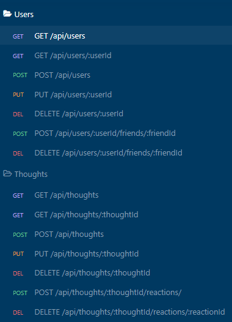

# Social Network API

[](https://opensource.org/licenses/MIT)

## Description

This project is an API for a social network web application where users can share their thoughts, react to friends’ thoughts, and create a friend list. The goal of this project was to understand the unstructured nature of NoSQL.

The technologies used in this application are:

- [Node.js](https://nodejs.org/en/)
- [Express.js](https://expressjs.com/) to run the web server
- [MongoDB](https://www.mongodb.com) to store the data
- [Mongoose](https://mongoosejs.com) as the object-document mapping (ODM) library to connect to the MongoDB database from Node.js
- [dotenv](https://www.npmjs.com/package/dotenv) to store environmental variables

### User Story

```md
AS A social media startup
I WANT an API for my social network that uses a NoSQL database
SO THAT my website can handle large amounts of unstructured data
```

### Acceptance Criteria

```md
GIVEN a social network API
WHEN I enter the command to invoke the application
THEN my server is started and the Mongoose models are synced to the MongoDB database
WHEN I open API GET routes in Insomnia for users and thoughts
THEN the data for each of these routes is displayed in a formatted JSON
WHEN I test API POST, PUT, and DELETE routes in Insomnia
THEN I am able to successfully create, update, and delete users and thoughts in my database
WHEN I test API POST and DELETE routes in Insomnia
THEN I am able to successfully create and delete reactions to thoughts and add and remove friends to a user’s friend list
```

## Table of Contents

- [Installation](#installation)
- [Usage](#usage)
- [License](#license)
- [Contributing](#contributing)
- [Questions](#questions)

## Installation

After downloading the score code, run the following commands from the home directory.

```bash
npm i
```

## Usage

To seed the database, run the following command:

```bash
npm run seed
```

The application will be invoked by using the following command:

```bash
npm start
```

### Screenshots

As there is no public-facing views in this project, the user will need to consume the apis using a tool like [Insomnia](https://insomnia.rest/). The api endpoints are:



### Video Walkthrough

[WEBM Video Link](https://drive.google.com/file/d/1fnLfsiL5PrnRFnZ65Q_BJ0EK6vPMZh5m/view)

## License

[](https://opensource.org/licenses/MIT)

This application is covered under the [MIT License](https://opensource.org/licenses/MIT).

## Contributing

As this project is part of an individual assignment for the University of Denver's Coding Bootcamp, it would be inappropriate for anyone else to contribute to this project.

## Questions

GitHub Link: [https://github.com/dpk5e7](https://github.com/dpk5e7)

Please contact me at Daniel.Kelly@du.edu with any additional questions you may have.
